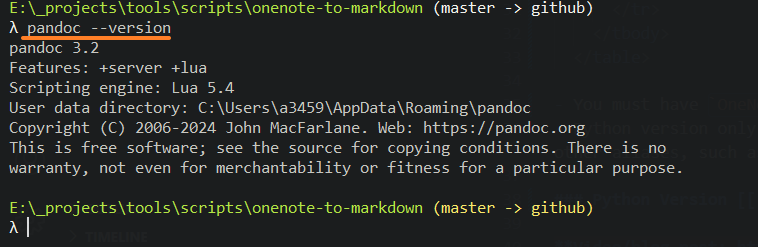
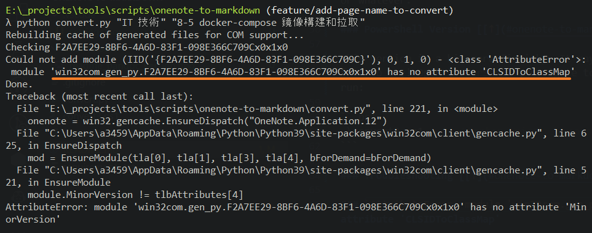

# onenote-to-markdown

## Contents [[↑](#onenote-to-markdown)]

- [onenote-to-markdown](#onenote-to-markdown)
  - [Contents \[↑\]](#contents-)
    - [Pre-requisites \[↑\]](#pre-requisites-)
    - [Python Version \[↑\]](#python-version-)
    - [PowerShell Version \[↑\]](#powershell-version-)
    - [Troubleshooting \[↑\]](#troubleshooting-)
    - [Forked from \[↑\]](#forked-from-)

### Pre-requisites [[↑](#onenote-to-markdown)]

- You must have `Pandoc` installed on your system and accessible in your system `PATH`. Check by running `pandoc --version` in a PowerShell or cmd window.

  <table width="100%">
    <colgroup>
      <col style="width: 100%" />
    </colgroup>
    <thead>
      <tr class="header">
      </tr>
    </thead>
    <tbody>
      <tr class="odd">
        <td>
          <p></p>
        </td>
      </tr>
    </tbody>
  </table>

- You must have `OneNote` installed on your system.
- **[Python Version ONLY]**: You must have Python 3 installed on your system. This `README` assumes it is accessible via `python`, but other aliases, such as `python3`, are fine.

### Python Version [[↑](#onenote-to-markdown)]

1. Install the requirements

    ```shell
    $ pip install -r requirements.txt
    ```

2. Open OneNote and ensure the notebook you'd like to convert is open.

3. Run the script

    ```shell
    $ python convert.py
    ```

4. Find your converted notes in `~/Desktop/OneNoteExport`. You're free to do what you want with the notes now - commit them to Git, open them in [obsidian](https://obsidian.md), or whatever.

### PowerShell Version [[↑](#onenote-to-markdown)]

This version is a bit more finnicky. It may fail, but feel free to try! Open `PowerShell`, navigate to this repo, and run:

```ps1
.\convert3.ps1
```

### Troubleshooting [[↑](#onenote-to-markdown)]

If you encounter the following error:

- `<class 'AttributeError'>: module 'win32com.gen_py....' has no attribute 'CLSIDToClassMap'`

  <table width="100%">
    <colgroup>
      <col style="width: 100%" />
    </colgroup>
    <thead>
      <tr class="header">
      </tr>
    </thead>
    <tbody>
      <tr class="odd">
        <td>
          <p></p>
        </td>
      </tr>
    </tbody>
  </table>

Try [this link](https://stackoverflow.com/questions/52889704/python-win32com-excel-com-model-started-generating-errors), and [this one](https://stackoverflow.com/questions/33267002/why-am-i-suddenly-getting-a-no-attribute-clsidtopackagemap-error-with-win32com). In short:

1. Run `python3` to get an interpreter and execute:

    ```python
    import win32com
    print(win32com.__gen_path__)
    ```

2. Delete the `gen_py` folder indicated in the output of the previous step.

### Forked from [[↑](#onenote-to-markdown)]

This repo is inspired by the youtube video [Python Update - Convert OneNote to Markdown (and Obsidian.md)](https://www.youtube.com/watch?v=mYbiT63Bkns) and forked from [onenote-to-markdown](https://gitlab.com/pagekey/edu/onenote-to-markdown). I will some modifications to the script to better suit my needs.
